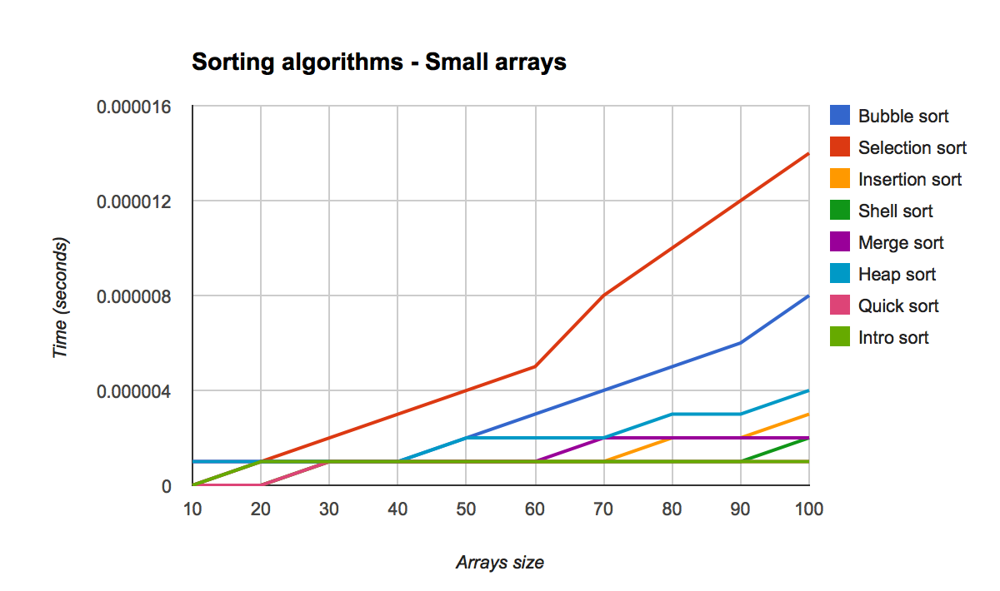
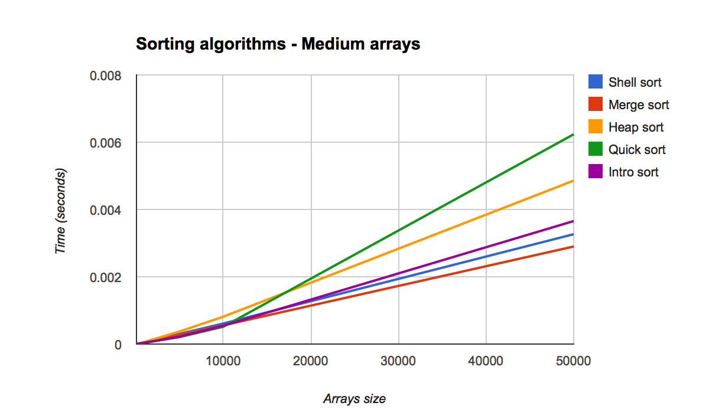
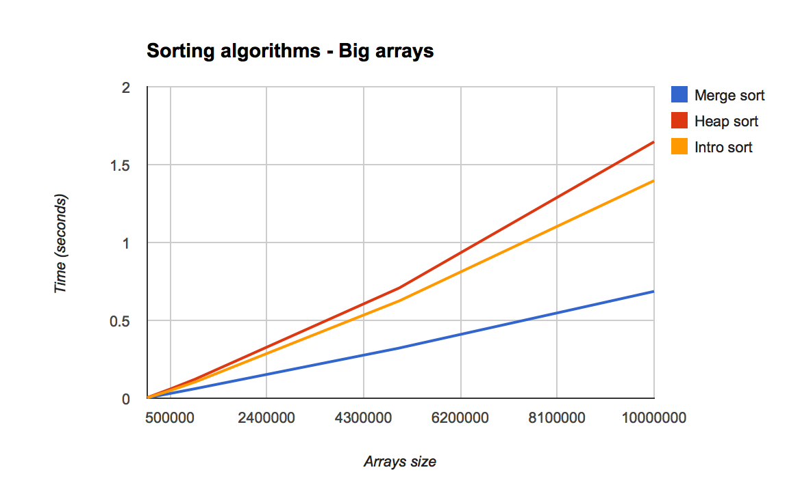

# Sorting Algorithms

## Introduction

### What is this document?
This document try to compare different algorithms to sort data.

In order to compare these methods, this document provides theoretical information and results of a practical experiment.

For each sorting, the following information are given:
- best case performances,
- average case performances,
- worst case performances,
- if the sorting is stable,
- if the sorting is in place,
- and the Wikipedia link.

The practical experiment executes sortings on:
- small arrays (between 10 and 100 elements),
- medium arrays (between 100 and 50,000 elements),
- big arrays (between 50,000 and 10,000,000 elements).

### Which algorithms are compared?
The algorithms I use in the document are the most common ones:
- [Bubble sort](#bubble-sort)
- [Selection sort](#selection-sort)
- [Insertion sort](#insertion-sort)
- [Shell sort](#shell-sort)
- [Merge sort](#merge-sort)
- [Heap sort](#heap-sort)
- [Quick sort](#quick-sort)
- [Intro sort](#intro-sort)

Be aware that comparisons are done with **my own implementation of every sorting algorithms**.

### Sources
Sources are developed in C language. They have been tested on OS X and Linux.  
Implementations are mine, so **they are provided without any warranty.**

To build them, you have two options:
- Use the `SortingAlgorithms.xcodeproj` file with Xcode (OS X).
- Use the `Makefile` file (OS X or Linux).

Here are the commands available with Makefile:
- `make`
- `make clean`
- `make fclean`

## Sorting algorithms

### Bubble sort
<blockquote>Best case performance: <em>T(n) = O(n)</em><br />
Average case performance: <em>T(n) = O(n<sup>2</sup>)</em><br />
Worst case performance: <em>T(n) = O(n<sup>2</sup>)</em>
</blockquote>

<blockquote>Stable: Yes.<br />
In place: Yes.<br />
Comment: Bad performances.
</blockquote>

<blockquote>Wikipedia link: http://en.wikipedia.org/wiki/Bubble_sort
</blockquote>

```c
#include "bubble_sort.h"

void bubble_sort(tab_type *tab, unsigned int size)
{
    tab_type        switch_done;
    unsigned int    i;
    tab_type        tmp;

    do
    {
        switch_done = 0;
        i = 0;
        while(i < size - 1)
        {
            if (tab[i] > tab[i + 1])
            {
                tmp = tab[i];
                tab[i] = tab[i + 1];
                tab[i + 1] = tmp;
                switch_done = 1;
            }
            i++;
        }
    }
    while (switch_done == 1);
}
```

### Selection sort
<blockquote>Best case performance: <em>T(n) = O(n<sup>2</sup>)</em><br />
Average case performance: <em>T(n) = O(n<sup>2</sup>)</em><br />
Worst case performance: <em>T(n) = O(n<sup>2</sup>)</em>  
</blockquote>

<blockquote>Stable: No.<br />
In place: Yes.<br />
Comment: Quick for less than 7 elements.
</blockquote>

<blockquote>Wikipedia link: http://en.wikipedia.org/wiki/Selection_sort
</blockquote>

```c
#include "selection_sort.h"

void selection_sort(tab_type *tab, unsigned int size)
{
    unsigned int    i;
    unsigned int    j;
    unsigned int    min;
    tab_type        tmp;

    i = 0;
    while (i < size - 1)
    {
        min = i;
        j = i + 1;
        while (j < size)
        {
            if (tab[j] < tab[min])
                min = j;
            j++;
        }

        if (min != i)
        {
            tmp = tab[i];
            tab[i] = tab[min];
            tab[min] = tmp;
        }

        i++;
    }
}
```

### Insertion sort
<blockquote>Best case performance: <em>T(n) = O(n)</em><br />
Average case performance: <em>T(n) = O(n<sup>2</sup>)</em><br />
Worst case performance: <em>T(n) = O(n<sup>2</sup>)</em>
</blockquote>

<blockquote>Stable: Yes.<br />
In place: Yes.<br />
Comment: Quick for less than 15 elements.
</blockquote>

<blockquote>Wikipedia link: http://en.wikipedia.org/wiki/Insertion_sort
</blockquote>

```c
#include "insertion_sort.h"

void insertion_sort(tab_type *tab, unsigned int size)
{
    unsigned int    i;
    unsigned int    j;
    tab_type        tmp;

    i = 1;
    while (i < size)
    {
        j = i;
        tmp = tab[j];
        while (j > 0 && tab[j - 1] > tmp)
        {
            tab[j] = tab[j - 1];
            j--;
        }
        tab[j] = tmp;
        i++;
    }
}
```

### Shell sort
<blockquote>Best case performance: <em>T(n) = O(n)</em><br />
Average case performance: <em>T(n) = O(n.(log(n))<sup>2</sup>)</em><br />
Worst case performance: <em>T(n) = O(n.(log(n))<sup>2</sup>)</em>
</blockquote>

<blockquote>Stable: No.<br />
In place: Yes.<br />
Comment: One of the best for less than 100 elements.
</blockquote>

<blockquote>Wikipedia link: http://en.wikipedia.org/wiki/Shellsort
</blockquote>

```c
#include "shell_sort.h"

void    shell_sort_sort(tab_type *tab, unsigned int size, unsigned int gap);

void shell_sort(tab_type *tab, unsigned int size)
{
    int gaps[] = {1, 4, 10, 23, 57, 132, 301, 701};
    int index;

    index = 8 - 1;
    while (index >= 0)
    {
        shell_sort_sort(tab, size, gaps[index]);
        index--;
    }
}

void shell_sort_sort(tab_type *tab, unsigned int size, unsigned int gap)
{
    unsigned int    i;
    unsigned int    j;
    tab_type        tmp;

    i = gap;
    while (i < size)
    {
        j = i;
        tmp = tab[j];
        while (j >= gap && tab[j - gap] > tmp)
        {
            tab[j] = tab[j - gap];
            j -= gap;
        }
        tab[j] = tmp;
        i++;
    }
}
```

### Merge sort
<blockquote>Best case performance: <em>T(n) = O(n.log(n))</em><br />
Average case performance: <em>T(n) = O(n.log(n))</em><br />
Worst case performance: <em>T(n) = O(n.log(n))</em>
</blockquote>

<blockquote>Stable: Yes.<br />
In place: Can be (it depends of implementation).<br />
Comment: Can be parallelized.
</blockquote>

<blockquote>Wikipedia link: http://en.wikipedia.org/wiki/Merge_sort
</blockquote>

```c
#include <stdio.h>
#include <stdlib.h>
#include <string.h>

#include "merge_sort.h"

void    merge_sort_divide(tab_type *list, unsigned int size, tab_type *list_tmp);
void    merge_sort_merge(tab_type *list_01, unsigned int size_01, tab_type *list_02, unsigned int size_02, tab_type *list_tmp);

void merge_sort(tab_type *tab, unsigned int size)
{
    tab_type    *list_tmp;

    if (!(list_tmp = malloc(sizeof(*list_tmp) * (size / 2))))
    {
        perror("Merge sort error: cannot alloc memory.");
        exit(EXIT_FAILURE);
    }

    merge_sort_divide(tab, size, list_tmp);

    free(list_tmp);
}

void merge_sort_divide(tab_type *list, unsigned int size, tab_type *list_tmp)
{
    unsigned int    size_01;
    unsigned int    size_02;

    size_01 = size / 2;
    size_02 = size - size_01;

    if (size_01 > 1)
        merge_sort_divide(list, size_01, list_tmp);

    if (size_02 > 1)
        merge_sort_divide(list + size_01, size_02, list_tmp);

    merge_sort_merge(list, size_01, list + size_01, size_02, list_tmp);
}

void merge_sort_merge(tab_type *list_01, unsigned int size_01, tab_type *list_02, unsigned int size_02, tab_type *list_tmp)
{
    tab_type    *ptr;
    tab_type    *ptr_01;
    tab_type    *ptr_02;

    memcpy(list_tmp, list_01, size_01);

    ptr = list_01;
    ptr_01 = list_tmp;
    ptr_02 = list_02;
    while(size_01 > 0)
    {
        if (size_02 > 0 && *ptr_02 <= *ptr_01)
        {
            *ptr = *ptr_02;
            ptr_02++;
            size_02--;
        }
        else
        {
            *ptr = *ptr_01;
            ptr_01++;
            size_01--;
        }

        ptr++;
    }
}
```

### Heap sort
<blockquote>Best case performance: <em>T(n) = O(n.log(n))</em><br />
Average case performance: <em>T(n) = O(n.log(n))</em><br />
Worst case performance: <em>T(n) = O(n.log(n))</em>
</blockquote>

<blockquote>Stable: No.<br />
In place: Yes.<br />
Comment: 2 times slower than the *Quick sort*.
</blockquote>

<blockquote>Wikipedia link: http://en.wikipedia.org/wiki/Heapsort
</blockquote>

```c
#include "heap_sort.h"

typedef enum
{
    heap_sort_switch_left,
    heap_sort_switch_none,
    heap_sort_switch_right
}   heap_sort_switch_type;

void                    heap_sort_sort_all(tab_type *tab, unsigned int size);
heap_sort_switch_type   heap_sort_switch(tab_type *tab, unsigned int size, unsigned int offset);

void heap_sort(tab_type *tab, unsigned int size)
{
    int                     end_offset;
    int                     switch_offset;
    heap_sort_switch_type   switch_val;
    tab_type                tmp;

    heap_sort_sort_all(tab, size);

    end_offset = size - 1;
    while (end_offset > 0)
    {
        tmp = tab[0];
        tab[0] = tab[end_offset];
        tab[end_offset] = tmp;

        switch_offset = 0;
        while ((switch_val = heap_sort_switch(tab, end_offset, switch_offset)) != heap_sort_switch_none)
        {
            switch_offset = (2 * switch_offset) + 1;

            if (switch_val == heap_sort_switch_right)
                switch_offset++;
        }

        end_offset--;
    }
}

void heap_sort_sort_all(tab_type *tab, unsigned int size)
{
    int                     root_offset;
    int                     switch_offset;
    heap_sort_switch_type   switch_val;

    root_offset = ((size - 1) / 2);
    while (root_offset >= 0)
    {
        switch_offset = root_offset;
        while ((switch_val = heap_sort_switch(tab, size, switch_offset)) != heap_sort_switch_none)
        {
            switch_offset = (2 * switch_offset) + 1;

            if (switch_val == heap_sort_switch_right)
                switch_offset++;
        }

        root_offset--;
    }
}

heap_sort_switch_type heap_sort_switch(tab_type *tab, unsigned int size, unsigned int offset)
{
    unsigned int            son_offset;
    heap_sort_switch_type   switch_ret;
    tab_type                tmp;

    switch_ret = heap_sort_switch_none;

    if ((2 * offset) + 1 >= size)
        return (switch_ret);

    if ((son_offset = (2 * offset) + 2) < size)
    {
        if (tab[son_offset - 1] > tab[son_offset])
        {
            son_offset--;
            switch_ret = heap_sort_switch_left;
        }
        else
            switch_ret = heap_sort_switch_right;
    }
    else if ((son_offset = (2 * offset) + 1) < size)
        switch_ret = heap_sort_switch_right;

    if (tab[offset] < tab[son_offset])
    {
        tmp = tab[offset];
        tab[offset] = tab[son_offset];
        tab[son_offset] = tmp;
    }

    return (switch_ret);
}
```

### Quick sort
<blockquote>Best case performance: <em>T(n) = O(n.log(n))</em><br />
Average case performance: <em>T(n) = O(n.log(n))</em><br />
Worst case performance: <em>T(n) = O(n<sup>2</sup>)</em>
</blockquote>

<blockquote>Stable: No.<br />
In place: Yes.<br />
Comment: Slow with a lot of elements.
</blockquote>

<blockquote>Wikipedia link: http://en.wikipedia.org/wiki/Quicksort
</blockquote>

```c
#include "main.h"
#include "quick_sort.h"
#include "shell_sort.h"

unsigned int    quick_sort_sort(tab_type *tab, unsigned int size);

void quick_sort(tab_type *tab, unsigned int size)
{
    unsigned int    pivot;

    if (size < 2)
        return ;

    if (size < 15)
    {
        shell_sort(tab, size);
        return ;
    }

    pivot = quick_sort_sort(tab, size);
    quick_sort(tab, pivot);

    if (size > pivot + 1)
        quick_sort(tab + pivot + 1, size - pivot - 1);
}

unsigned int quick_sort_sort(tab_type *tab, unsigned int size)
{
    unsigned int    i;
    unsigned int    j;
    tab_type        pivot;
    tab_type        tmp;

    i = 0;
    j = size - 2;
    pivot = tab[size - 1];
    while (i < j)
    {
        if (tab[i] > pivot)
        {
            while (i < j && tab[j] > pivot)
                j--;

            if (i < j)
            {
                tmp = tab[i];
                tab[i] = tab[j];
                tab[j] = tmp;
                i++;
            }
        }
        else
            i++;
    }

    if (tab[i] > tab[size - 1])
    {
        tmp = tab[i];
        tab[i] = tab[size - 1];
        tab[size - 1] = tmp;
    }
    else
        i = size - 1;

    return (i);
}
```

### Intro sort
<blockquote>Best case performance: <em>T(n) = O(n.log(n))</em><br />
Average case performance: <em>T(n) = O(n.log(n))</em><br />
Worst case performance: <em>T(n) = O(n.log(n))</em>
</blockquote>

<blockquote>Stable: No.<br />
In place: Yes.<br />
Comment: Used in standard libraries.
</blockquote>

<blockquote>Wikipedia link: http://en.wikipedia.org/wiki/Introsort
</blockquote>

```c
#include <tgmath.h>

#include "heap_sort.h"
#include "intro_sort.h"
#include "main.h"
#include "shell_sort.h"

void intro_sort_rec(tab_type *tab, unsigned int size, unsigned int deep, double deep_max);
unsigned int    intro_sort_sort(tab_type *tab, unsigned int size);

void intro_sort(tab_type *tab, unsigned int size)
{
    double  deep_max;

    deep_max = 2 * log(size);
    intro_sort_rec(tab, size, 0, deep_max);
}

void intro_sort_rec(tab_type *tab, unsigned int size, unsigned int deep, double deep_max)
{
    unsigned int    pivot;

    if (size < 2)
        return ;

    if (size < 15)
    {
        shell_sort(tab, size);
        return ;
    }

    if (deep > deep_max)
    {
        heap_sort(tab, size);
        return ;
    }

    pivot = intro_sort_sort(tab, size);
    intro_sort_rec(tab, pivot, deep + 1, deep_max);

    if (size > pivot + 1)
        intro_sort_rec(tab + pivot + 1, size - pivot - 1, deep + 1, deep_max);
}

unsigned int intro_sort_sort(tab_type *tab, unsigned int size)
{
    unsigned int    i;
    unsigned int    j;
    tab_type        pivot;
    tab_type        tmp;

    i = 0;
    j = size - 2;
    pivot = tab[size - 1];
    while (i < j)
    {
        if (tab[i] > pivot)
        {
            while (i < j && tab[j] > pivot)
                j--;

            if (i < j)
            {
                tmp = tab[i];
                tab[i] = tab[j];
                tab[j] = tmp;
                i++;
            }
        }
        else
            i++;
    }

    if (tab[i] > tab[size - 1])
    {
        tmp = tab[i];
        tab[i] = tab[size - 1];
        tab[size - 1] = tmp;
    }
    else
        i = size - 1;

    return (i);
}
```

### Summary
|Sorting|Best|Average|Worst|Stable|In place|Comment|
|:---|:---|:---|:---|:---:|:---:|:---|
|Bubble sort|*T(n) = O(n)*|*T(n) = O(n<sup>2</sup>)*|*T(n) = O(n<sup>2</sup>)*|Yes|Yes|Bad performances.|
|Selection sort|*T(n) = O(n<sup>2</sup>)*|*T(n) = O(n<sup>2</sup>)*|*T(n) = O(n<sup>2</sup>)*|No|Yes|Quick for less than 7 elements.|
|Insertion sort|*T(n) = O(n)*|*T(n) = O(n<sup>2</sup>)*|*T(n) = O(n<sup>2</sup>)*|Yes|Yes|Quick for less than 15 elements.|
|Shell sort|*T(n) = O(n)*|*T(n) = O(n.(log(n))<sup>2</sup>)*|*T(n) = O(n.(log(n))<sup>2</sup>)*|No|Yes|One of the best for less than 100 elements.|
|Merge sort|*T(n) = O(n.log(n))*|*T(n) = O(n.log(n))*|*T(n) = O(n.log(n))*|Yes|Can be|Can be parallelized.|
|Heap sort|*T(n) = O(n.log(n))*|*T(n) = O(n.log(n))*|*T(n) = O(n.log(n))*|No|Yes|2 times slower than the *Quick sort*.|
|Quick sort|*T(n) = O(n.log(n))*|*T(n) = O(n.log(n))*|*T(n) = O(n<sup>2</sup>)*|No|Yes|Slow with a lot of elements.|
|Intro sort|*T(n) = O(n.log(n))*|*T(n) = O(n.log(n))*|*T(n) = O(n.log(n))*|No|Yes|Used in standard libraries.|

## Performances

### How do I get these results?

In order to obtain representative results, I use the following method for each array size:

1. An array of size n is generated randomly.
2. Every sorting is executed on the array and its execution time is saved.
3. An other array of size n is generated randomly.
4. Every sorting is executed on the array and its execution time is saved.
5. [...] 100 arrays are generated and sorted.
6. For each sorting, the time average is computed.

### Small array
|Name|10|20|30|40|50|60|70|80|90|100|
|:---|:---:|:---:|:---:|:---:|:---:|:---:|:---:|:---:|:---:|:---:|
|Bubble sort|0.000000|0.000001|0.000001|0.000001|0.000002|0.000003|0.000004|0.000005|0.000006|0.000008|
|Selection sort|0.000000|0.000001|0.000002|0.000003|0.000004|0.000005|0.000008|0.000010|0.000012|0.000014|
|Insertion sort|0.000000|0.000000|0.000001|0.000001|0.000001|0.000001|0.000001|0.000002|0.000002|0.000003|
|Shell sort|0.000000|0.000000|0.000001|0.000001|0.000001|0.000001|0.000001|0.000001|0.000001|0.000002|
|Merge sort|0.000001|0.000001|0.000001|0.000001|0.000001|0.000001|0.000002|0.000002|0.000002|0.000002|
|Heap sort|0.000001|0.000001|0.000001|0.000001|0.000002|0.000002|0.000002|0.000003|0.000003|0.000004|
|Quick sort|0.000000|0.000000|0.000001|0.000001|0.000001|0.000001|0.000001|0.000001|0.000001|0.000001|
|Intro sort|0.000000|0.000001|0.000001|0.000001|0.000001|0.000001|0.000001|0.000001|0.000001|0.000001|

<p align="left" >

</p>

### Medium array
|Name|100|500|1000|5000|10000|50000|
|:---|:---:|:---:|:---:|:---:|:---:|:---:|
|Shell sort|0.000002|0.000024|0.000056|0.000301|0.000610|0.003266|
|Merge sort|0.000003|0.000022|0.000049|0.000270|0.000557|0.002901|
|Heap sort|0.000004|0.000028|0.000062|0.000372|0.000813|0.004860|
|Quick sort|0.000002|0.000017|0.000038|0.000207|0.000514|0.006237|
|Intro sort|0.000002|0.000016|0.000039|0.000217|0.000544|0.003657|

<p align="left" >

</p>

### Big array
|Name|50000|100000|500000|1000000|5000000|10000000|
|:---|:---:|:---:|:---:|:---:|:---:|:---:|
|Merge sort|0.002890|0.005743|0.030806|0.062123|0.322641|0.686372|
|Heap sort|0.004784|0.010205|0.059118|0.123979|0.708811|1.646923|
|Intro sort|0.003678|0.007999|0.049421|0.105570|0.625566|1.397493|

<p align="left" >

</p>

## Credit
This document and sources are written and developed by [Sébastien MICHOY](http://www.linkedin.com/in/sebastienmichoy).

## Feedback
If you find a bug, feel free to create a Github issue!

## License
This document and sources are available under the BSD license. Please see the LICENSE file for more information.
